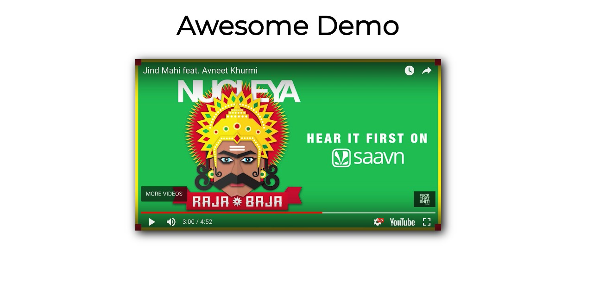

# Simple Video player showcase
> ready to use template for demo page for a youtube video

## Usage
>in App.js
```jsx
     <YouTube
            className='player'
            id='player'
            // change video id here
            videoId='EyvA65wimJs'
            opts={opts}
            onReady={this._onReady}
          />
```

## demo
> [live demo](http://aniket965.github.io/React-video-showcase/)

